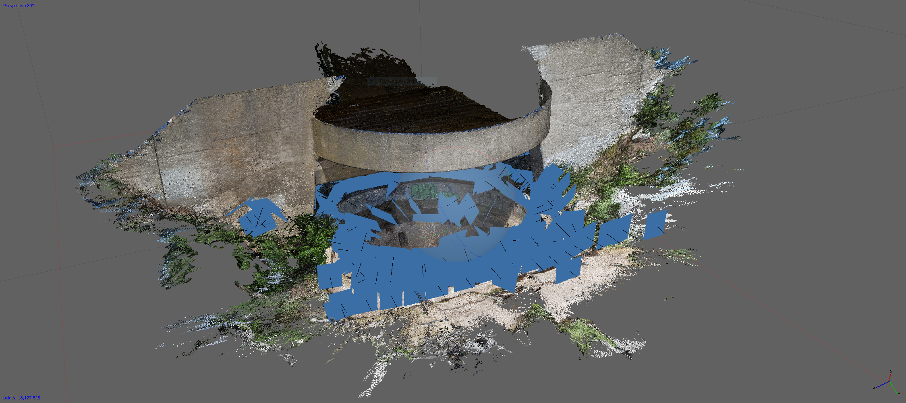
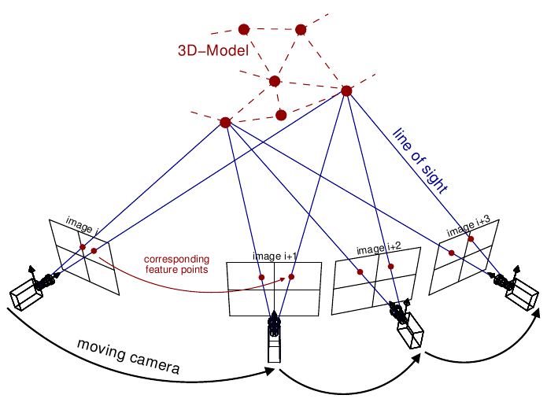
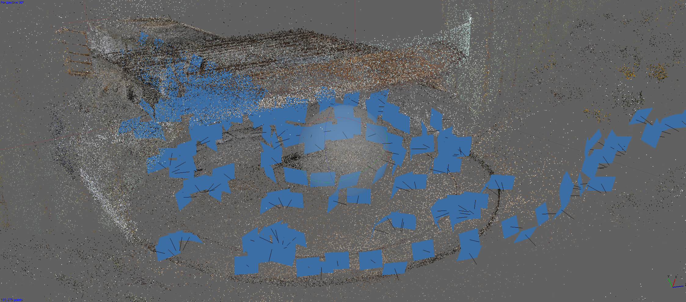
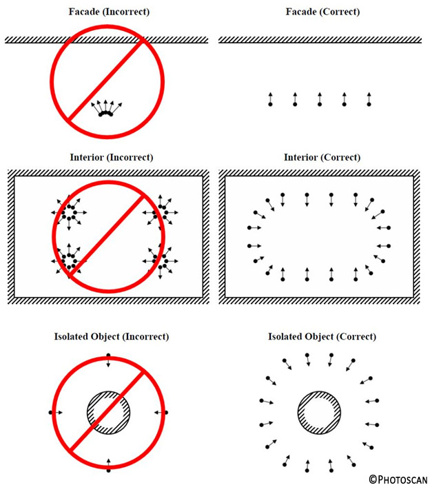
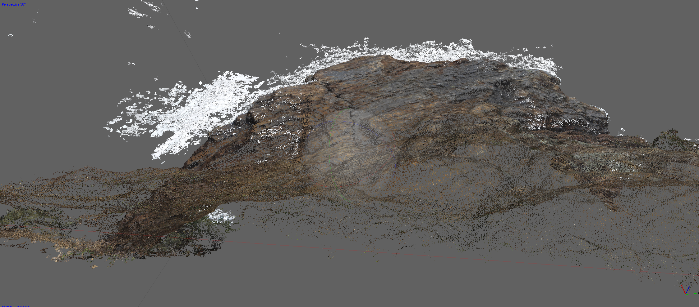

# Introduction to Photogrammetry

Gabriel Dunne  
www [gabrieldunne.com](http://gabrieldunne.com)  
twitter [@gabrieldunne](https://twitter.com/gabrieldunne)  
ig [@gabrieldunne](https://instagram.com/gabrieldunne)  

###### Headlands Bunker Scan (Dense Cloud with Image Planes), Agisoft Screenshot. Source: [Okaynokay, Twilight Engines](http://oknk.studio/twilightengines) 2019

## Prerequsite Materials

  - Computer
  - Camera
  - [Agisoft Metashape](https://www.agisoft.com/downloads/installer/) (30 Day Trial)

## Background

Creating 3D objects from 2D photographs requires a specific type of image capture. The process allows you to scan everything from objects and people, to architecture and landscapes. This workshop goes over the entire process from start to finish, including photographic techniques, lighting conditions, and post-processing methods to generate accurate 3D models from photos. There are a few different strategies you can use when acquiring images, and this workshop provides a starting point for you to scan objects and architectural spaces.

###### Structure from Motion (SfM) photogrammetric principle. Source: [theia-sfm.org](http://theia-sfm.org/) 2016

## Schedule

  Class time: **2p - 5p** (3 hours)

  - **2p - 2:20p** - Intro & Orientation (20 min)
  - **2:20p - 3p** - Capturing/processing demo (40 min)
  - **3p - 3:50** - Self-Initiation Scanning projects. Indoor, or Outdoor. Do multiple scans! (50 min)
  - **3:50 - 4:40** - Image processing (50 min)
  - **4:40 - 5pm** - Project Sharing, Wrap up (20 min)

## Definition

  **Photogrammetry** *[noun]* The science or technique for obtaining reliable information on the natural environment or physical objects by recording, measuring and interpreting photographic images or produced by electromagnetic radiation or other phenomena.

  Greek:

  - *"photos"* (light)
  - *"gramma"* (something written or drawn)
  - *"metron"* (measure)

## Abridged History of Photogrammetry

  - **1046 BC - 256 BC** Discovery and capture of natural optical phenomena. Perforated gnomons projecting a pinhole image of the sun were described in the Chinese Zhoubi Suanjing writings. Some ancient sightings of gods and spirits, especially in temple worship, are thought to possibly have been conjured up by means of camera obscura projections.
  - **500 BC** Camera Obscura. (500 BC in China, 350 BC Aristote, 1000 Al-Haytham, 1500 Léonard de Vinci)
  - **1430** Leon Battista Alberti, "Rerum Mathematicarum et Descriptio Urbis Romae". Developments of topographic mapping.
  - **1611** First documents of Camera Lucida, eventually Patented in 1806 by William Hyde Wollaston.
  - **1836** Daguerreotype, “gift to the world” from French Academy. First publicly available photographic process.
  - **1851** French officer Aime Laussedat develops the firstphotogrammetrical devices and methods.
  - **1858** The German architect A. Meydenbauer develops photogrammetrical techniques for the documentation of buildings.
  - **1866** The Viennese physicist Ernst Mach publishes the idea to use the  stereoscope to estimate volumetric measures.
  - **1885** The ancient ruins of Persepolis were the first archaeological object  recorded photogrammetrically.
  - **1889** The first German manual of photogrammetry was published by C. Koppe.
  - **1896** Eduard Gaston and Daniel Deville present the first stereoscopic instrument for  vectorized mapping.
  - **1910** The ISP (International Society for Photogrammetry), now ISPRS, was founded  by E. Dolezal in Austria.
  - **1911** First aerial photogrammetry with rectified photographs by Th. Scheimpflug.
  - **1964** First architectural tests with the new stereometric camera-system, which had been invented by Carl Zeiss, Oberkochen and Hans Foramitti, Vienna.
  - **1980** Due to improvements in computer hardware and software, digital photogrammetry gains more and more accessibility.
  - **2000's** Increasing accessibiulity of photography drones

# Photography Technique

###### Headlands Bunker Scan (Sparse Cloud with Image Planes), Agisoft Screenshot. Source: [Okaynokay, Twilight Engines](http://oknk.studio/twilightengines) 2019

## Camera

  - The best camera is the one you have that offers the sharpest image
  - RAW format if possible for best quality
  - Large storage if you take a lot of pictures, especially if you shoot in RAW
  - Pixel count is less important than physical optics (lens) quality and clarity.
  - Use a fixed focal length during the whole session. Avoid lens distortion. If you have a physical zoom, make sure it doesn't shift during your session.
  - ISO: As low as possible
  - Shutter speed: As fast as possible
  - Aperture: F8, higher is better
  - 50mm Optimum Focal Length
  - White Balance: Manual — NOT Auto
  - Bokeh is bad! Increase aperture for larger DOF for sharper photos.
  - Overcast/foggy/diffuse lighting is ideal — Soft shadows, low contrast give the most even images.

## Optional Equipment

  - Tripod/Monopod for stable shots
  - Color Checker For color accuracy
  - Scale Bar for measurement
  - Ground control points for picture overlap
  - Spray: Water or paint for reflective surfaces
  - Turntable for small objects in a controlled environment)
  - Drone for large swaths of terrain, autonomous aerial scans

## Guidelines

###### Source: [Agisoft Photoscan Manual](https://www.agisoft.com/pdf/photoscan-pro_1_4_en.pdf)

  - Don’t worry about taking too many photos. Remove bad ones later.
  - Use the highest resolution possible
  - Each point on the scene must be seen in at least TWO images, and you should aim for THREE. Optimal overlap is about 80%
  - Always physically move when taking photos. DO NOT just rotate
  - Rotate the camera on both axis, not just one
  - Don’t change a rotational viewpoint more than 30 degrees in a series
  - Care about object TEXTURE, avoid plain/monotonous or glittering/reflective surfaces.
  - Start with the entire scene or object, and gradually hone in on details
  - Complete loops. Go around objects and end up where you started
  - Pictures are processed in order, so stay organized
  - Dont just take one loop, take multiples from various angles
  - Turntable Method: Object moves, camera stays still
  - Walk-Around Method: Object stays still, camera moves
  - Trust your instincts, break rules, test ideas!

## Practice

###### Headlands Rock Scan, (Sparse Point Cloud). Agisoft Screenshot. Source: [Gabriel Dunne](http://gabrieldunne.com) 2019

The best way to learn is to practice! Here are some ideas for things to scan.

  - A rock
  - Statue or a monument
  - Building facade
  - Fire hydrant
  - A curb or urban object
  - A vehicle like a car or a bicycle or skateboard
  - Shoe
  - Handbag or backpack
  - Tunnel or some stairs
  - Room, interior scene
  - Building Exterior
  - A reflective surface, a mirror in a room (will break spectacularly!)
  - Someones head or body (they have to be still!)
  - An Insect
  - A plant
  - Food
  - Terrain with a Drone

## Processing with Agisoft

Refer to the article [Making Models with Photogrammetry](http://media.quilime.com/pg/pdf/Agisoft-Making_Models_With_Photogrammetry_[Agisoft-Photoscan].pdf)

  1. Import photos
  2. Inspect loaded images, removing unnecessary images
  3. Align photos, build sparse cloud
  4. Build dense point cloud
  5. Clean up Points with Manual Selection
  6. Building mesh
  7. Generating texture
  8. Export 3D Mesh

### 3D Software Suggestions (Free):

  - [Meshlab](http://www.meshlab.net/)
  - [Meshmixer](http://www.meshmixer.com/)
  - [Blender](https://www.blender.org/)

## Photogrammatry Software

I chose to use [Agisoft](http://www.agisoft.com/) in this workshop because I'm personally familair with it and use it in my workflow. However, there are many photogrammetry softwares out there. Here's a few:

  - [AliceVision](https://alicevision.org)  - Free, Open Source
  - [COLMAP](https://all3dp.com/1/best-photogrammetry-software/#colmap) - Free
  - [Meshroom](https://alicevision.github.io/#meshroom) - Free, Open Source
  - [MicMac](https://micmac.ensg.eu/index.php/Accueil) - Free, open source
  - [Regard3D](http://www.regard3d.org/index.php) - Free, open source
  - [VisualSFM](http://ccwu.me/vsfm/) - Free for Non profit, personal use
  - [OpenMVG](https://qgis.org/en/site/) - Free
  - [RealityCapture](https://www.capturingreality.com/Home), Commercial
  - [Autodesk ReCap](https://www.autodesk.com/products/recap/overview), Commercial
  - [Bentley ContextCapture](https://www.bentley.com/en/products/brands/contextcapture), Commercial
  - [IMAGINE Photogrammetry](https://www.hexagongeospatial.com/products/power-portfolio/imagine-photogrammetry), Commercial
  - [iWitnessPRO](http://www.iwitnessphoto.com/), Commercial
  - [DroneDeploy](https://www.dronedeploy.com/), Commercial
  - [Pix4D](https://pix4d.com/), Commercial
  - [Photomodeler](https://www.photomodeler.com/index.html), Commercial
  - [3DF Zephyr](https://www.3dflow.net/), Commercial

## Articles and References

  - [3D-Scan-Anything-Using-a-Camera-Photogrammetry-With-Autodesk-Remake.pdf](./pdf/3D-Scan-Anything-Using-a-Camera-Photogrammetry-With-Autodesk-Remake.pdf)
  - [3D-Scanning-Class.pdf](./pdf/3D-Scanning-Class.pdf)
  - [3D-scanning-Photogrammetry-with-a-rotating-platform.pdf](./pdf/3D-scanning-Photogrammetry-with-a-rotating-platform.pdf)
  - [3d-Scan-Anything-Using-Just-a-Camera.pdf](./pdf/3d-Scan-Anything-Using-Just-a-Camera.pdf)
  - [Aaron_Pattee--Photogrammetric_Procedure_for_Modeling_Castles_and_Ceramics_2016_1.pdf](./pdf/Aaron_Pattee--Photogrammetric_Procedure_for_Modeling_Castles_and_Ceramics_2016_1.pdf)
  - [Agisoft-BASIC_TUTORIAL_FOR_AGISOFT_PHOTOSCAN_ENG.pdf](./pdf/Agisoft-BASIC_TUTORIAL_FOR_AGISOFT_PHOTOSCAN_ENG.pdf)
  - [Agisoft-Making_Models_With_Photogrammetry_[Agisoft-Photoscan].pdf](./pdf/Agisoft-Making_Models_With_Photogrammetry_[Agisoft-Photoscan].pdf)
  - [Agisoft-PS_1.0.0 -Tutorial (BL) - 3D-model.pdf](./pdf/Agisoft-PS_1.0.0 -Tutorial (BL) - 3D-model.pdf)
  - [Agisoft-PS_1.1 -Tutorial (IL) - Building.pdf](./pdf/Agisoft-PS_1.1 -Tutorial (IL) - Building.pdf)
  - [Agisoft-PS_1.3 -Tutorial (BL) - Orthophoto, DEM (GCPs).pdf](./pdf/Agisoft-PS_1.3 -Tutorial (BL) - Orthophoto, DEM (GCPs).pdf)
  - [Agisoft-TUTORIAL_CREATING_MASKS_IN_PHOTOSHOP_TO.pdf](./pdf/Agisoft-TUTORIAL_CREATING_MASKS_IN_PHOTOSHOP_TO.pdf)
  - [Agisoft-TUTORIAL_PHOTOSCAN_AND_CLOUD_COMPARE_ENG.pdf](./pdf/Agisoft-TUTORIAL_PHOTOSCAN_AND_CLOUD_COMPARE_ENG.pdf)
  - [Agisoft-metashape_presentation.pdf](./pdf/Agisoft-metashape_presentation.pdf)
  - [Agisoft-photoscan-pro_1_4_en.pdf](./pdf/Agisoft-photoscan-pro_1_4_en.pdf)
  - [Dezzi-Bardeschi-Geomatic-for-conservation_the-shadow-and-the-reality-reading-the-sperimental-and-theoretic-efforts-of-worldwide-recognized-genius.pdf](./pdf/Dezzi-Bardeschi-Geomatic-for-conservation_the-shadow-and-the-reality-reading-the-sperimental-and-theoretic-efforts-of-worldwide-recognized-genius.pdf)
  - [Drones_in_Archaeology_Special_Issue_SAA_Record_March2016.pdf](./pdf/Drones_in_Archaeology_Special_Issue_SAA_Record_March2016.pdf)
  - [Education_In_Photogrammetry_Laussedat_1952_mar_21-26.pdf](./pdf/Education_In_Photogrammetry_Laussedat_1952_mar_21-26.pdf)
  - [Erwin-Kruppa.pdf](./pdf/Erwin-Kruppa.pdf)
  - [Free-Photogrammetry-on-Mac-OS-From-Photos-to-3D-Mo.pdf](./pdf/Free-Photogrammetry-on-Mac-OS-From-Photos-to-3D-Mo.pdf)
  - [Fundamentals_of_Photogrammetry.pdf](./pdf/Fundamentals_of_Photogrammetry.pdf)
  - [Fundamentals_of_Photogrammetry_2.pdf](./pdf/Fundamentals_of_Photogrammetry_2.pdf)
  - [Historical_Survey_of_Computer_Vision.pdf](./pdf/Historical_Survey_of_Computer_Vision.pdf)
  - [History_of_Photogrammetry.pdf](./pdf/History_of_Photogrammetry.pdf)
  - [Image Capture Tips - Equipment and Shooting Scenarios.pdf](./pdf/Image Capture Tips - Equipment and Shooting Scenarios.pdf)
  - [Introduction_To_Photogrammetry.pdf](./pdf/Introduction_To_Photogrammetry.pdf)
  - [Joseph Azzam - Everything_you_need_to_Know_about_Photogrammetry_(i-hope).pdf](./pdf/Joseph Azzam - Everything_you_need_to_Know_about_Photogrammetry_(i-hope).pdf)
  - [Persopolis.pdf](./pdf/Persopolis.pdf)
  - [Photography-Class.pdf](./pdf/Photography-Class.pdf)
  - [SHN-Archival-3D-Photography-CoDA-Ashley.pdf](./pdf/SHN-Archival-3D-Photography-CoDA-Ashley.pdf)
  - [SPARC_Photogrammetry.pdf](./pdf/SPARC_Photogrammetry.pdf)
  - [Section VII - Photogrammetric Surveys.pdf](./pdf/Section VII - Photogrammetric Surveys.pdf)
  - [Teachings_of_Basic_Photogrammetry_1943_jun_86-100.pdf](./pdf/Teachings_of_Basic_Photogrammetry_1943_jun_86-100.pdf)
  - [The Art of Photogrammetry- How To Take Your Photos - Tested.pdf](./pdf/The Art of Photogrammetry- How To Take Your Photos - Tested.pdf)
  - [The Art of Photogrammetry- Introduction to Software and Hardware - Tested.pdf](./pdf/The Art of Photogrammetry- Introduction to Software and Hardware - Tested.pdf)
  - [The poor man’s guide to photogrammetry – BBB3viz.pdf](./pdf/The poor man’s guide to photogrammetry – BBB3viz.pdf)
  - [Unity-Photogrammetry-Workflow_2017-07_v2.pdf](./pdf/Unity-Photogrammetry-Workflow_2017-07_v2.pdf)
  - [Using-ComputerVision-Photogrammetry_YAMAFUNE-DISSERTATION-2016.pdf](./pdf/Using-ComputerVision-Photogrammetry_YAMAFUNE-DISSERTATION-2016.pdf)

## Emergence of Mathematical Solutions related to Photogrammetry

### [3D Pose Problem](https://en.wikipedia.org/wiki/3D_pose_estimation), [\[2\]](http://www.ignaciomellado.es/blog/The-relative-pose-problem-A-chronology)

  - **1615** - [Snellius](https://en.wikipedia.org/wiki/Willebrord_Snellius)
  - **1773** - [Lagrange](https://en.wikipedia.org/wiki/Joseph-Louis_Lagrange)
  - **1841** - [Grunert](https://www.wikidata.org/wiki/Q88398)

### [Epipolar geometry](https://en.wikipedia.org/wiki/Epipolar_geometry)

  - **1862** - [Terrero](https://es.wikipedia.org/wiki/Antonio_Terrero_y_D%C3%ADaz_Herrero)
  - **1883** - [Hauck](https://www.deepdyve.com/lp/de-gruyter/neue-constructionen-der-perspective-und-photogrammetrie-theorie-der-9q068d0OOO)
  - **1899** - [Finsterwalder](https://en.wikipedia.org/wiki/Sebastian_Finsterwalder)

### [Trifocal Tensor](https://en.wikipedia.org/wiki/Trifocal_tensor)

  - **1883** - [Hauck](https://www.deepdyve.com/lp/de-gruyter/neue-constructionen-der-perspective-und-photogrammetrie-theorie-der-9q068d0OOO)

### [Motion Estimation](https://en.wikipedia.org/wiki/Motion_estimation)

  - 1880 - [Schroter: 4 point problem for coplanar object points](https://en.wikipedia.org/wiki/Heinrich_Schr%C3%B6ter)
  - 1913 - [Kruppa: 5 point problem](https://arxiv.org/pdf/1801.01454.pdf)
  - 2003 - [Nister: First algorithm for the 5 point problem that gives at most 10 solutions](https://www.semanticscholar.org/paper/An-efficient-solution-to-the-five-point-relative-Nist%C3%A9r/2621597b539f2930df0c8aafe0464b36f6876067)

### [3D Reconstruction from Multiple Images](https://en.wikipedia.org/wiki/3D_reconstruction_from_multiple_images)
  
  - **1800** - [Laussedat](https://en.wikipedia.org/wiki/Rephotography)
  - **1883** - [Hauck](https://www.deepdyve.com/lp/de-gruyter/neue-constructionen-der-perspective-und-photogrammetrie-theorie-der-9q068d0OOO)
  - **1892** - [Meydenbauer](https://en.wikipedia.org/wiki/Rephotography)

### [3D reconstruction from uncalibrated images & projective reconstruction](https://en.wikipedia.org/wiki/3D_reconstruction)

  - **1883** - [Hauck](https://www.deepdyve.com/lp/de-gruyter/neue-constructionen-der-perspective-und-photogrammetrie-theorie-der-9q068d0OOO)
  - **1899** - [Finsterwalder](https://en.wikipedia.org/wiki/Sebastian_Finsterwalder)

### [Camera self-calibration](https://en.wikipedia.org/wiki/Camera_auto-calibration)

  - **1892** - [Meydenbauer](https://en.wikipedia.org/wiki/Rephotography)
  - **1899** - [Finsterwalder](https://en.wikipedia.org/wiki/Sebastian_Finsterwalder)

---

&copy; [Gabriel Dunne](http://gabrieldunne.com), 2019
